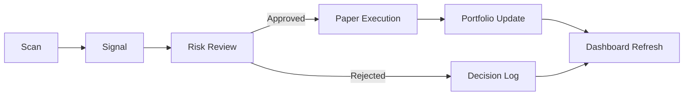

# Trading Dashboard Sketch

## Goal

Sketch a V1 front-end for the autonomous trading agent with a clean Next.js route structure, a trading-focused dashboard, and clear boundaries between app shell, feature panels, and shared UI components.

## Information Architecture

```text
/                  Dashboard overview
/scan              Market scanner
/signals           Trade candidates and decision log
/portfolio         Holdings, P/L, and exposure
/trades            Order history and execution status
/settings          Data source, risk, execution mode
```

## Dashboard Layout

```text
┌──────────────────────────────────────────────────────────────────────────────┐
│ Topbar: logo | environment status | execution mode | last refresh | user menu │
├───────────────┬───────────────────────────────────────────────┬──────────────┤
│ Sidebar       │ KPI row                                      │ Right rail   │
│ - Dashboard   │ - Equity                                      │ - Latest     │
│ - Scan        │ - Cash                                        │   signals    │
│ - Signals     │ - Unrealized P/L                              │ - Approvals  │
│ - Portfolio   │ - Realized P/L                                │ - Alerts     │
│ - Trades      │ - Risk budget                                 │              │
│ - Settings    ├───────────────────────────────────────────────┤              │
│               │ Main chart + positions                        │              │
│               │ - Equity curve                                │              │
│               │ - Open positions table                         │              │
│               │ - Exposure by ticker                           │              │
│               ├───────────────────────────────────────────────┤              │
│               │ Bottom row                                     │              │
│               │ - Decision log                                 │              │
│               │ - Recent fills                                 │              │
│               │ - System health                                │              │
└───────────────┴───────────────────────────────────────────────┴──────────────┘
```

## Component Map

### App Shell

- `app/layout.tsx`: global layout, fonts, theme, metadata
- `components/layout/sidebar.tsx`: primary navigation
- `components/layout/topbar.tsx`: status, refresh, environment chips
- `components/layout/page-shell.tsx`: page width, spacing, section headings

### Dashboard Components

- `components/charts/equity-chart.tsx`: equity curve
- `components/charts/pnl-sparkline.tsx`: compact P/L view
- `components/trading/signal-card.tsx`: signal summary with action, confidence, and reason tags
- `components/trading/order-ticket.tsx`: paper trade ticket
- `components/trading/position-row.tsx`: open position display
- `components/trading/risk-summary.tsx`: risk budget and exposure panel

### Feature Modules

- `features/scan/`: scanner filters, result table, market summary
- `features/signals/`: signal stream, approvals, decision log
- `features/portfolio/`: holdings table, allocation view, performance metrics
- `features/trades/`: blotter, fills, execution timeline
- `features/settings/`: execution mode, provider, risk controls

## Data Flow



## Visual Behavior

- Dense, information-first layout with strong hierarchy
- No marketing hero section; the dashboard should feel like a working terminal for trading
- Use color only for state: green for approved/positive, red for risk/rejection, amber for warnings
- Keep the sidebar fixed on desktop and collapsible on smaller screens
- Keep charts compact and above the fold
- Decision log should be readable as an audit trail, not just a list of notifications

## V1 Screen Priorities

1. `Dashboard`
2. `Signals`
3. `Portfolio`
4. `Scan`
5. `Trades`
6. `Settings`

## Notes

- This sketch is intentionally conservative: it fits the current backend shape and avoids introducing a heavy front-end architecture before the trading core is stable.
- The next iteration can turn this into a real Next.js route/component scaffold.
